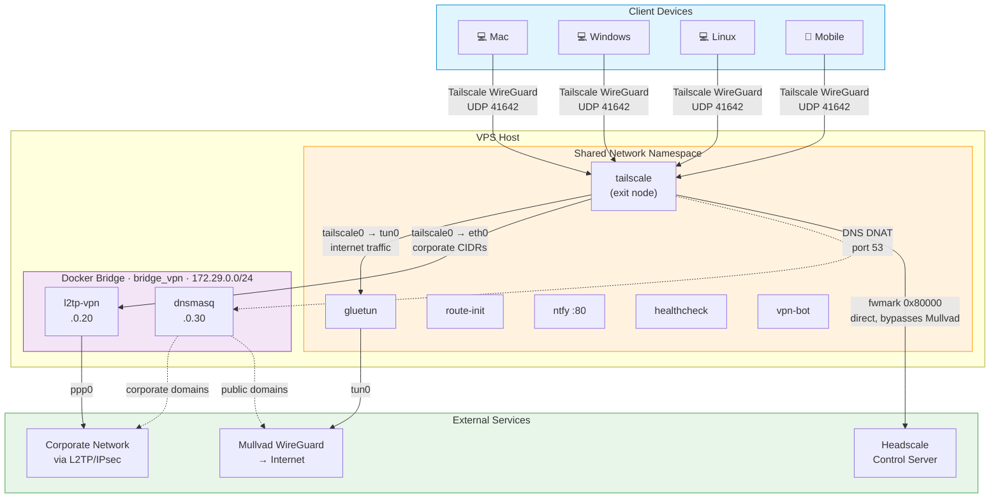

# vpn-meshgate

Self-hosted Tailscale exit node that splits traffic across multiple VPN
tunnels — corporate network via L2TP/IPsec, internet via Mullvad
WireGuard — with split DNS, remote control, and push notifications.
Deploy on any Linux VPS with Docker Compose.

Requires a self-hosted [Headscale](https://github.com/juanfont/headscale)
control server (open-source Tailscale coordination server).

Select vpn-meshgate as your exit node and traffic is automatically split:

- **Corporate traffic** (`COMPANY_CIDRS`) routes through L2TP/IPsec
- **All other traffic** routes through Mullvad WireGuard
- **DNS** is split: corporate domains via corporate DNS, everything
  else via public DNS through Mullvad
- **Tailscale control plane** routes directly to your Headscale
  server, independent of Mullvad

## Prerequisites

- A running [Headscale](https://github.com/juanfont/headscale)
  instance — this is the coordination server that manages your
  Tailscale mesh network
- Linux VPS with Docker and Docker Compose
- L2TP kernel module:
  ```bash
  sudo apt install linux-modules-extra-$(uname -r)
  sudo modprobe l2tp_ppp
  echo l2tp_ppp | sudo tee /etc/modules-load.d/l2tp.conf
  ```
- IP forwarding: `sysctl -w net.ipv4.ip_forward=1`
- Mullvad VPN account (WireGuard credentials)
- Corporate L2TP/IPsec VPN credentials

## Architecture



**Traffic paths:**

| Traffic | Path | Exit |
|---------|------|------|
| Internet | tailscale0 → tun0 | Mullvad IP |
| Corporate | tailscale0 → eth0 → l2tp-vpn → ppp0 | Corporate network |
| DNS (corporate) | MagicDNS → DNAT → dnsmasq → corporate DNS | via L2TP |
| DNS (public) | MagicDNS → DNAT → dnsmasq → public DNS | via Mullvad |
| Tailscale WireGuard | fwmark 0x80000 → table 201 → host | VPS real IP |

## Headscale Configuration

vpn-meshgate connects to your Headscale instance. Follow these steps
to set up the node and DNS.

### 1. Create a User

```bash
headscale users create vpn
headscale users list   # note the numeric ID
```

### 2. Generate a Preauth Key

```bash
headscale preauthkeys create --user <USER_ID> --reusable --expiration 365d
```

Replace `<USER_ID>` with the numeric ID from `headscale users list`.
Save the output — use it as `TS_AUTHKEY` in `.env`.

### 3. Configure DNS

Edit your Headscale `config.yaml` to push DNS settings to all nodes.
This is required for split DNS to work through MagicDNS.

```yaml
dns:
  magic_dns: true
  base_domain: your-tailnet.example.com

  nameservers:
    global:
      - 1.1.1.1                          # intercepted by DNAT on VPS → dnsmasq
    split:
      company.example.com:               # your corporate domain
        - 100.64.0.XX                    # vpn-meshgate's Tailscale IP

  search_domains:
    - company.example.com
```

Global nameservers get DNAT'd to dnsmasq on the VPS, so the actual
upstream doesn't matter — dnsmasq handles the split. The split entry
routes corporate domain queries directly to the exit node via
Tailscale, where they're intercepted and forwarded to dnsmasq.

Restart Headscale after editing `config.yaml`.

### 4. Start the Stack and Register the Node

After [Setup](#setup) below, the Tailscale container will register
automatically using the preauth key.

Verify the node is registered:

```bash
headscale nodes list
```

### 5. Approve Exit Node and Subnet Routes

List advertised routes:

```bash
headscale nodes list-routes
```

Approve the exit node route (`0.0.0.0/0`) and subnet routes:

```bash
headscale nodes approve-routes \
  --identifier <NODE_ID> \
  --routes 0.0.0.0/0,::/0,10.11.0.0/16
```

Replace `10.11.0.0/16` with your `COMPANY_CIDRS`.

### 6. Connect Client Devices

On each client device, install Tailscale and connect to your
Headscale instance:

```bash
tailscale up --login-server https://your-headscale.example.com
```

Then select the exit node and accept DNS:

```bash
tailscale set --exit-node=<TS_HOSTNAME> --accept-dns
```

`--accept-dns` is required for MagicDNS-based split DNS to work.

## Setup

1. Clone the repo on your VPS:
   ```bash
   git clone https://github.com/povesma/vpn-meshgate.git && cd vpn-meshgate
   ```

2. Create `.env` from the template:
   ```bash
   cp .env.example .env
   ```

3. Edit `.env` with your credentials (see [Configuration](#configuration)).

4. Start the stack:
   ```bash
   docker compose up -d
   ```

5. Approve routes in Headscale (see [step 5 above](#5-approve-exit-node-and-subnet-routes)).

## Verification

```bash
# All containers healthy
docker ps

# From your client device (with exit node active):
curl ifconfig.me                    # → Mullvad IP
ping <corporate-host-ip>            # → reachable via L2TP
nslookup <host>.<COMPANY_DOMAIN>    # → resolved via corporate DNS
nslookup example.com                # → resolved via public DNS
```

## Configuration

All configuration is via `.env`. See `.env.example` for the full list.

| Variable | Description |
|---|---|
| `TS_AUTHKEY` | Headscale preauth key |
| `TS_HOSTNAME` | Tailscale hostname for this exit node |
| `HEADSCALE_URL` | Headscale control server URL |
| `WIREGUARD_PRIVATE_KEY` | Mullvad WireGuard private key |
| `WIREGUARD_ADDRESSES` | Mullvad WireGuard address |
| `MULLVAD_COUNTRY` | Mullvad server country |
| `L2TP_SERVER` | Corporate L2TP server hostname/IP |
| `L2TP_USERNAME` | L2TP username |
| `L2TP_PASSWORD` | L2TP password |
| `L2TP_PSK` | IPsec pre-shared key |
| `COMPANY_CIDRS` | Comma-separated CIDRs routed through L2TP |
| `COMPANY_DOMAIN` | Domain suffix for split DNS |
| `VPS_PUBLIC_IP` | VPS public IP (for health check) |
| `L2TP_CHECK_IP` | Corporate IP to ping for health check |
| `NTFY_TOPIC` | ntfy notification topic (default: `vpn-alerts`) |
| `NTFY_CMD_TOPIC` | ntfy command topic (default: `vpn-cmd`) |
| `GLUETUN_API_KEY` | Gluetun API key (must match `gluetun/auth/config.toml`) |

## Notifications

ntfy runs inside the Tailscale namespace, reachable via MagicDNS from
any device on your tailnet.

### Subscribe from Your Phone

1. Install the [ntfy app](https://ntfy.sh) on your phone
   ([Android](https://play.google.com/store/apps/details?id=io.heckel.ntfy) /
   [iOS](https://apps.apple.com/app/ntfy/id1625396347))

2. Tap the **+** button to add a subscription

3. In the **Topic name** field, enter your topic name (e.g.
   `vpn-alerts` — must match your `NTFY_TOPIC` env var)

4. Enable the **"Use another server"** toggle (Android) or edit the
   **Server URL** field (iOS)

5. Enter your server URL: `http://<TS_HOSTNAME>` — this is the
   MagicDNS hostname of your vpn-meshgate node (e.g.
   `http://vpn-router`)

6. Tap **Subscribe**

You'll get push notifications when VPN tunnels go down or recover.

> **Tip (Android):** To avoid entering the server URL for each topic,
> go to **Settings → General → Default server** and set it to
> `http://<TS_HOSTNAME>`.

## Remote Control

The `vpn-bot` container listens on a separate ntfy topic for commands.
Subscribe to the command topic the same way as above, using your
`NTFY_CMD_TOPIC` (default: `vpn-cmd`).

Send commands and receive responses within the same topic:

| Command | Description |
|---|---|
| `ping` | Check bot is alive (returns uptime) |
| `status` | Show tunnel status |
| `ip` | Show current public exit IP |
| `restart company` | Restart L2TP tunnel |
| `restart mullvad` | Restart Mullvad tunnel (requires `confirm`) |
| `disable company` | Stop L2TP permanently (SSH to re-enable) |
| `dns test` | Test split DNS resolution |
| `help` | List commands |

`restart mullvad` requires two-step confirmation: send the command,
then `confirm` within 30 seconds.

`disable company` requires SSH to re-enable by design — if an attacker
compromises a Tailscale node, they cannot restore the corporate tunnel
via ntfy.

## Troubleshooting

```bash
# Container logs
docker compose logs gluetun
docker compose logs l2tp-vpn
docker compose logs tailscale
docker compose logs dnsmasq

# Routing inside gluetun namespace
docker exec gluetun ip route
docker exec gluetun ip rule show
docker exec route-init ip route show table 201

# L2TP tunnel
docker exec l2tp-vpn ip addr show ppp0
docker exec l2tp-vpn ip route

# Tailscale status
docker exec tailscale tailscale status
docker exec tailscale tailscale netcheck
docker exec tailscale tailscale ping <peer>
```

## TODO

- [ ] Web UI / Android app for tunnel management
- [ ] Mullvad country switching from the UI
- [ ] Traffic statistics dashboard
- [ ] Auto-heal for namespace desync: when tailscale0 disappears after gluetun recreate, automatically recreate namespace containers (healthcheck detects but can't self-fix since it's also in the namespace — needs an external watcher or the switcher to handle recovery)

## Deep Dive

For detailed documentation on routing tables, iptables rules, DNS
architecture, MTU chain, and all the dead ends we hit along the way,
see [docs/networking-deep-dive.md](docs/networking-deep-dive.md).

## Contributing

Feel free to clone, open issues, or submit PRs:

```bash
git clone https://github.com/povesma/vpn-meshgate.git
```

[Open an issue](https://github.com/povesma/vpn-meshgate/issues) |
[Submit a PR](https://github.com/povesma/vpn-meshgate/pulls)
