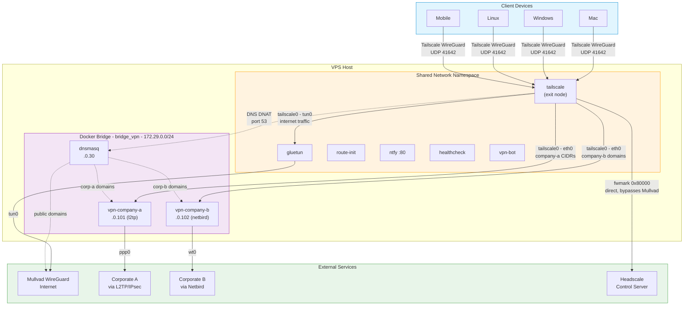

# vpn-meshgate

Self-hosted Tailscale exit node that splits traffic across multiple VPN
tunnels — corporate networks via L2TP/IPsec, WireGuard, OpenVPN, or
Netbird; internet via Mullvad WireGuard — with split DNS, remote
control, and push notifications. Deploy on any Linux VPS with Docker
Compose.

Requires a self-hosted [Headscale](https://github.com/juanfont/headscale)
control server (open-source Tailscale coordination server).

Select vpn-meshgate as your exit node and traffic is automatically split:

- **Corporate traffic** routes through designated VPN instances
  (each with its own tunnel type, credentials, and CIDRs)
- **All other traffic** routes through Mullvad WireGuard
- **DNS** is split: corporate domains via corporate DNS, everything
  else via public DNS through Mullvad
- **Tailscale control plane** routes directly to your Headscale
  server, independent of Mullvad

## Prerequisites

- A running [Headscale](https://github.com/juanfont/headscale)
  instance — this is the coordination server that manages your
  Tailscale mesh network
- Linux VPS with Docker and Docker Compose
- L2TP kernel module (if using L2TP instances):
  ```bash
  sudo apt install linux-modules-extra-$(uname -r)
  sudo modprobe l2tp_ppp
  echo l2tp_ppp | sudo tee /etc/modules-load.d/l2tp.conf
  ```
- IP forwarding: `sysctl -w net.ipv4.ip_forward=1`
- Mullvad VPN account (WireGuard credentials)
- Python 3 + PyYAML on your local machine: `pip install pyyaml`

## Architecture



**Traffic paths:**

| Traffic | Path | Exit |
|---------|------|------|
| Internet | tailscale0 - tun0 | Mullvad IP |
| Corporate A | tailscale0 - eth0 - vpn-company-a - ppp0 | Corporate A |
| Corporate B | tailscale0 - eth0 - vpn-company-b - wt0 | Corporate B |
| DNS (corporate) | MagicDNS - DNAT - dnsmasq - instance DNS | via VPN |
| DNS (public) | MagicDNS - DNAT - dnsmasq - public DNS | via Mullvad |
| Tailscale WireGuard | fwmark 0x80000 - table 201 - host | VPS real IP |

## Setup

### 1. Clone and Configure

```bash
git clone https://github.com/povesma/vpn-meshgate.git && cd vpn-meshgate
cp .env.example .env
```

Edit `.env` with your Mullvad, Tailscale, and ntfy settings (see
[Configuration](#configuration)).

### 2. Define VPN Instances

```bash
cp secrets/vpn-instances.yaml.example secrets/vpn-instances.yaml
```

Each instance defines a VPN tunnel with its type, credentials, CIDRs,
and optional DNS domains. Supported types: `l2tp`, `wireguard`,
`openvpn`, `netbird`.

**Netbird note:** Netbird uses domain-based routing. Put only the
overlay network CIDR (e.g. `10.75.0.0/16`) in `cidrs`. Add company
domains to `dns_domains` — Netbird's DNS resolver handles the
domain-to-IP routing automatically via the gateway peer.

### 3. Generate Docker Compose Override

```bash
python3 generate-vpn.py
```

This reads `secrets/vpn-instances.yaml` and produces:
- `docker-compose.override.yml` — per-instance container definitions
  (no secrets)
- `vpn-instances.json` — runtime config for route-init, bot,
  healthcheck, dnsmasq (no secrets)
- `.env.vpn-*` — per-instance credential files (0600 permissions)

### 4. Update `.env` with Derived Values

```bash
# All dns_domains from vpn-instances.yaml in *.domain format
VPN_DNS_DOMAINS=*.company-a.com,*.company-b.com

# All static CIDRs from vpn-instances.yaml, comma-separated
# (Netbird domain-routed IPs don't need to be listed here)
VPN_ADVERTISE_ROUTES=10.11.0.0/16,10.75.0.0/16
```

`VPN_DNS_DOMAINS` is used by gluetun to allow private-IP DNS
responses for company domains.

`VPN_ADVERTISE_ROUTES` is used by Tailscale to advertise subnet
routes to Headscale. Without this, private CIDRs are dropped by
the exit node.

### 5. Deploy

```bash
docker compose up -d --build
```

Or remotely:

```bash
./deploy-push.sh
./rdocker.sh compose up -d --force-recreate --build
```

**Important:** Always use `--force-recreate` when env files or config
changed. Docker Compose does not detect `.env` or `env_file` content
changes — without `--force-recreate` containers keep stale values.

### 6. Approve Routes in Headscale

```bash
headscale nodes list-routes
headscale nodes approve-routes \
  --identifier <NODE_ID> \
  --routes 0.0.0.0/0,::/0,10.11.0.0/16,10.75.0.0/16
```

Replace CIDRs with your `VPN_ADVERTISE_ROUTES` value. Include
`0.0.0.0/0,::/0` for exit node functionality.

**Routes must be re-approved whenever `VPN_ADVERTISE_ROUTES` changes.**

### 7. Connect Client Devices

```bash
tailscale up --login-server https://your-headscale.example.com
tailscale set --exit-node=<TS_HOSTNAME> --accept-dns
```

`--accept-dns` is required for MagicDNS-based split DNS to work.

## Headscale DNS Configuration

Edit your Headscale `config.yaml`:

```yaml
dns:
  magic_dns: true
  base_domain: your-tailnet.example.com

  nameservers:
    global:
      - 1.1.1.1
    split:
      company.example.com:
        - 100.64.0.XX    # vpn-meshgate's Tailscale IP

  search_domains:
    - company.example.com
```

Restart Headscale after editing.

## Verification

```bash
docker compose ps                       # all containers running
curl ifconfig.me                        # Mullvad IP
ping <corporate-host-ip>                # reachable via VPN
nslookup <host>.company.com             # resolved via corporate DNS
nslookup example.com                    # resolved via public DNS
```

## Configuration

### `.env` — Infrastructure Settings

| Variable | Description |
|---|---|
| `TS_AUTHKEY` | Headscale preauth key |
| `TS_HOSTNAME` | Tailscale hostname for this exit node |
| `HEADSCALE_URL` | Headscale control server URL |
| `WIREGUARD_PRIVATE_KEY` | Mullvad WireGuard private key |
| `WIREGUARD_ADDRESSES` | Mullvad WireGuard address |
| `MULLVAD_COUNTRY` | Mullvad server country |
| `VPS_PUBLIC_IP` | VPS public IP (for Mullvad health check) |
| `VPN_DNS_DOMAINS` | All company domains in `*.domain` format |
| `VPN_ADVERTISE_ROUTES` | All VPN CIDRs for Tailscale |
| `NTFY_TOPIC` | ntfy notification topic (default: `vpn-alerts`) |
| `NTFY_CMD_TOPIC` | ntfy command topic (default: `vpn-cmd`) |
| `GLUETUN_API_KEY` | Gluetun API key |

### `secrets/vpn-instances.yaml` — VPN Instance Config

See `secrets/vpn-instances.yaml.example` for the full format.

| Field | Required | Description |
|---|---|---|
| `name` | yes | Unique identifier (alphanumeric + hyphens) |
| `type` | yes | `l2tp`, `wireguard`, `openvpn`, or `netbird` |
| `cidrs` | yes | CIDRs to route through this tunnel |
| `dns_domains` | no | Domains for split DNS via this tunnel |
| `check_ip` | no | IP to ping for health monitoring |
| `server` | l2tp | VPN server hostname/IP |
| `config_file` | wg/ovpn | Path to WireGuard or OpenVPN config |
| `credentials` | varies | Type-specific auth (see example) |
| `management_url` | netbird | Netbird management server URL |

**Netbird specifics:** Netbird uses domain-based routing managed by
the Netbird management server. The `cidrs` field should contain only
the overlay network. Add company domains to `dns_domains` — dnsmasq
forwards them to Netbird's DNS resolver, which resolves the domain
and automatically routes the resulting IP through the gateway peer.

## Notifications

ntfy runs inside the Tailscale namespace, reachable via MagicDNS from
any device on your tailnet. Alerts include the instance name so you
know which tunnel is affected.

### Subscribe from Your Phone

1. Install the [ntfy app](https://ntfy.sh)
   ([Android](https://play.google.com/store/apps/details?id=io.heckel.ntfy) /
   [iOS](https://apps.apple.com/app/ntfy/id1625396347))
2. Add subscription with topic `vpn-alerts` (or your `NTFY_TOPIC`)
3. Set server URL to `http://<TS_HOSTNAME>` (MagicDNS hostname)

## Remote Control

Subscribe to `NTFY_CMD_TOPIC` (default: `vpn-cmd`) the same way.

| Command | Description |
|---|---|
| `ping` | Check bot is alive (returns uptime) |
| `status` | Show per-instance tunnel status |
| `ip` | Show current public exit IP |
| `restart <name>` | Restart a specific VPN instance |
| `restart company` | Restart all VPN instances |
| `restart mullvad` | Restart Mullvad tunnel (requires `confirm`) |
| `disable <name>` | Stop a specific VPN instance (SSH to re-enable) |
| `disable company` | Stop all VPN instances (SSH to re-enable) |
| `mullvad <cc>` | Switch Mullvad exit country |
| `dns test` | Test split DNS resolution |
| `help` | List commands |

## Adding or Changing VPN Instances

1. Edit `secrets/vpn-instances.yaml`
2. Run `python3 generate-vpn.py`
3. Update `VPN_DNS_DOMAINS` and `VPN_ADVERTISE_ROUTES` in `.env`
   if CIDRs or domains changed
4. Deploy:
   ```bash
   ./deploy-push.sh
   ./rdocker.sh compose up -d --force-recreate --build
   ```
5. If CIDRs changed, re-approve routes in Headscale:
   ```bash
   headscale nodes approve-routes \
     --identifier <NODE_ID> \
     --routes 0.0.0.0/0,::/0,<all-cidrs>
   ```

## Troubleshooting

```bash
# Container logs
docker compose logs gluetun
docker compose logs vpn-<instance-name>
docker compose logs tailscale
docker compose logs dnsmasq
docker compose logs route-init

# Routing inside gluetun namespace
docker exec gluetun ip route
docker exec gluetun ip rule show

# VPN instance tunnel
docker exec vpn-<name> ip addr show ppp0   # L2TP
docker exec vpn-<name> ip addr show wg0    # WireGuard
docker exec vpn-<name> ip addr show tun0   # OpenVPN
docker exec vpn-<name> ip addr show wt0    # Netbird
docker exec vpn-<name> netbird status      # Netbird peers/routes

# Tailscale status
docker exec tailscale tailscale status
```

## TODO

- [ ] Web UI / Android app for tunnel management
- [ ] Traffic statistics dashboard
- [ ] Auto-heal for namespace desync
- [ ] DNS-based routing for L2TP (auto-route IPs from company domains)

## Deep Dive

For detailed documentation on routing tables, iptables rules, DNS
architecture, MTU chain, and all the dead ends we hit along the way,
see [docs/networking-deep-dive.md](docs/networking-deep-dive.md).

## Contributing

```bash
git clone https://github.com/povesma/vpn-meshgate.git
```

[Open an issue](https://github.com/povesma/vpn-meshgate/issues) |
[Submit a PR](https://github.com/povesma/vpn-meshgate/pulls)
