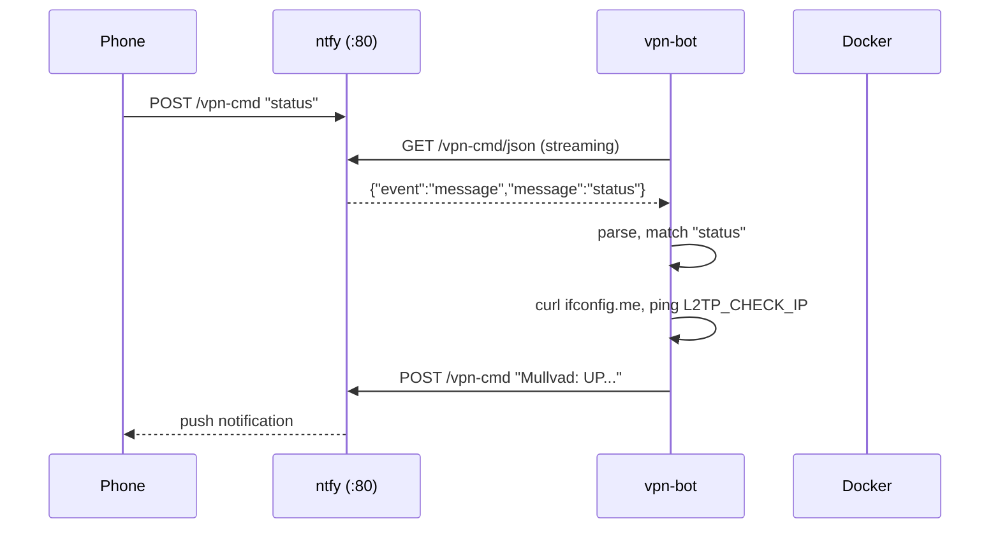
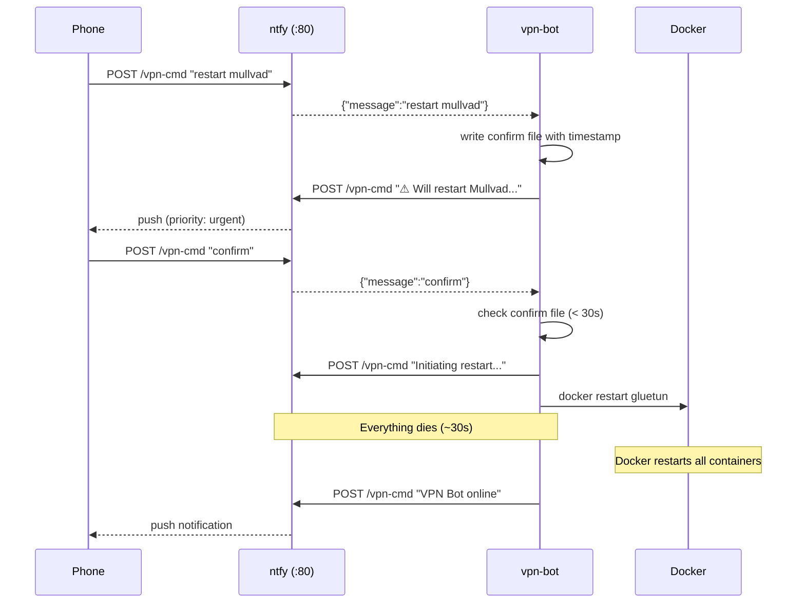

# 001-NTFY-CONTROL: VPN Remote Control via ntfy - Technical Design

**Status**: Draft
**PRD**: [2026-03-20-001-NTFY-CONTROL-prd.md](2026-03-20-001-NTFY-CONTROL-prd.md)
**Created**: 2026-03-20

## Overview

A new `vpn-bot` container subscribes to a dedicated ntfy command
topic via the JSON streaming API. When a message arrives, it
parses the command against a whitelist, executes it, and
publishes the response to the alerts topic. Container restarts
use the Docker socket mounted from the host.

## Current Architecture

**Relevant components:**
- `healthcheck/check.sh` — existing shell script pattern: Alpine
  + curl + simple loop. Publishes to ntfy via HTTP POST with
  title/priority headers. This is the pattern to follow.
- `gluetun/post-rules.txt` — iptables INPUT rule already allows
  TCP port 80 from `tailscale0` (added for ntfy accessibility).
- `docker-compose.yml` — ntfy, healthcheck, tailscale all use
  `network_mode: service:gluetun`. vpn-bot follows this pattern.
- ntfy JSON streaming API: `GET /topic/json` returns newline-
  delimited JSON. Connection stays open, messages arrive as
  `{"event":"message","message":"..."}` lines. Keepalive events
  sent periodically.

**Past decisions (from VPN-001):**
- Shell scripts over compiled binaries for infrastructure code
- Alpine-based custom images (~5MB)
- Environment variables for all configuration
- `restart: unless-stopped` on all services

## Proposed Design

### Architecture Diagram

```
┌─────────── Gluetun Shared Namespace ──────────┐
│                                                │
│  vpn-bot                                       │
│  ┌──────────────────────────────────────────┐  │
│  │ curl -s localhost:80/vpn-cmd/json        │  │
│  │   │                                      │  │
│  │   ├─ parse JSON message                  │  │
│  │   ├─ match against command whitelist     │  │
│  │   ├─ execute (curl/ping/docker)          │  │
│  │   └─ POST response to localhost:80/      │  │
│  │        vpn-alerts                        │  │
│  └──────────────┬───────────────────────────┘  │
│                 │                               │
│  ntfy (:80)     │  healthcheck                  │
│  tailscale      │  route-init                   │
│  gluetun        │                               │
└─────────────────┼───────────────────────────────┘
                  │
    /var/run/docker.sock (mounted from host)
                  │
                  ▼
         Docker Engine (host)
         ├─ docker restart l2tp-vpn
         └─ docker restart gluetun
```

### Container: vpn-bot

**Image:** Custom Alpine + curl + docker-cli + iputils-ping +
bind-tools (for `dig`)

**Dockerfile** (`bot/Dockerfile`):
```dockerfile
FROM alpine:3.21
RUN apk add --no-cache curl iputils-ping bind-tools \
    docker-cli
COPY bot.sh /bot.sh
RUN chmod +x /bot.sh
CMD ["/bot.sh"]
```

Note: `docker-cli` provides the `docker` command without the
daemon. ~15MB addition to the Alpine base.

**docker-compose.yml entry:**
```yaml
vpn-bot:
  build: ./bot
  container_name: vpn-bot
  network_mode: service:gluetun
  volumes:
    - /var/run/docker.sock:/var/run/docker.sock
  environment:
    - NTFY_CMD_TOPIC=${NTFY_CMD_TOPIC:-vpn-cmd}
    - NTFY_TOPIC=${NTFY_TOPIC:-vpn-alerts}
    - VPS_PUBLIC_IP=${VPS_PUBLIC_IP}
    - L2TP_CHECK_IP=${L2TP_CHECK_IP}
  depends_on:
    gluetun:
      condition: service_healthy
    ntfy:
      condition: service_healthy
  restart: unless-stopped
```

### Core Script: bot.sh

**Subscription mechanism:**
```sh
curl -sf --no-buffer "http://127.0.0.1:80/${CMD_TOPIC}/json" \
    | while IFS= read -r line; do
        # parse and handle each JSON message
    done
```

`--no-buffer` ensures messages arrive immediately (no curl
buffering). The `while read` loop processes one JSON line at a
time. When the connection drops (ntfy restart, network issue),
curl exits, and the outer retry loop reconnects.

**JSON parsing:** Use lightweight `jq`-free parsing. ntfy JSON
messages have a predictable format:
```json
{"event":"message","message":"status","id":"...","time":...}
```

Extract `event` and `message` fields with `grep -o` / `sed`.
Only process lines where `event` is `message` (skip `open` and
`keepalive` events).

**Self-reply flood prevention:** Since bot replies are posted to the same
`vpn-cmd` topic it subscribes to, the bot would receive its own replies and
enter an infinite loop. Fix: ignore any message that contains a `title` field
— bot replies always set a Title header, while user messages from the ntfy app
never do.

```sh
echo "${line}" | grep -q '"title":' && return
```

If parsing becomes fragile, `jq` can be added (~1MB). But for
a whitelist of simple string commands, string matching suffices.

**Command dispatch:** Strict whitelist match on the extracted
message text (trimmed, lowercased):

```sh
case "$cmd" in
    ping)               cmd_ping ;;
    status)             cmd_status ;;
    ip)                 cmd_ip ;;
    "restart company")  cmd_restart_company ;;
    "restart mullvad")  cmd_restart_mullvad ;;
    "disable company")  cmd_disable_company ;;
    "dns test")         cmd_dns_test ;;
    help)               cmd_help ;;
    confirm)            cmd_confirm ;;
    *)                  cmd_unknown "$cmd" ;;
esac
```

No shell interpolation of user input. The `case` statement only
matches exact strings. Any non-matching input falls through to
`cmd_unknown`.

### Command Implementations

**Response function** (mirrors healthcheck's `notify`):
```sh
reply() {
    local title="$1" msg="$2" priority="${3:-default}"
    curl -sf -X POST "http://127.0.0.1:80/${CMD_TOPIC}" \
        -H "Title: ${title}" \
        -H "Priority: ${priority}" \
        -d "${msg}" 2>/dev/null
}
```

Responses are posted back to the same `CMD_TOPIC` (`vpn-cmd`) so the user
sees commands and responses in a single ntfy topic. Only healthcheck
notifications (tunnel down/up events) use the separate `vpn-alerts` topic.

**ping:** Reply with `pong` + container uptime from `/proc/uptime`.

**status:**
1. Check Mullvad: `curl -sf ifconfig.me` — if result matches
   `VPS_PUBLIC_IP` or times out, Mullvad is down
2. Check Company: `ping -c1 -W5 ${L2TP_CHECK_IP}` — if fails,
   L2TP is down
3. Format response with named labels:
   ```
   Mullvad: UP (185.x.x.x)
   Company: UP (10.11.0.1 reachable)
   ```

**ip:** `curl -sf --max-time 10 ifconfig.me`

**restart company:**
1. Reply "Restarting Company VPN..."
2. `docker restart l2tp-vpn`
3. Wait for container to be running (poll `docker inspect`)
4. Reply "Company VPN restarted. Status: {up/down}"

**restart mullvad (confirmation flow):**

State machine using a temp file:
```
/tmp/vpn-bot-confirm-mullvad
```

1. On `restart mullvad`:
   - Write current timestamp to confirm file
   - Reply with warning (priority: urgent)
2. On `confirm`:
   - Check if confirm file exists and is < 30s old
   - If valid: reply "Initiating Mullvad restart...",
     then `docker restart gluetun`
   - If expired/missing: reply "Nothing to confirm"
3. Cleanup: on each command, delete confirm file if > 30s old

After gluetun restarts, vpn-bot's curl stream dies. Docker
restarts vpn-bot (via `restart: unless-stopped`). On startup,
vpn-bot sends a "VPN Bot online" message to the alerts topic
as a recovery signal.

**disable company:**
1. `docker stop l2tp-vpn`
2. `docker update --restart=no l2tp-vpn` — prevents restart on crash or VPS reboot
3. Reply with confirmation (priority: urgent)

Re-enable via SSH only:
```bash
docker update --restart=unless-stopped l2tp-vpn
docker start l2tp-vpn
```

**dns test:**
1. `dig +short @127.0.0.1 <company_domain>` — should return
   internal IP via company DNS
2. `dig +short @127.0.0.1 example.com` — should return public
   IP via Mullvad DNS
3. Format response with results

Note: `COMPANY_DOMAIN` env var needed. Add to docker-compose.

**help:** Static string listing all commands.

### Rate Limiting

Track last command + timestamp in a file:
```
/tmp/vpn-bot-last-cmd
```
Format: `<timestamp> <command>`

On each command:
1. Read last-cmd file
2. If same command AND timestamp < 60s ago → reply "already
   processed" and skip
3. Otherwise → write new timestamp + command, execute

### Sequence Diagrams

#### Normal Command Flow



#### Restart Mullvad (Confirmation)



### Reconnection Strategy

The outer loop in bot.sh handles stream disconnections:

```sh
while true; do
    log "Connecting to command stream..."
    curl -sf --no-buffer \
        "http://127.0.0.1:80/${CMD_TOPIC}/json" \
        | while IFS= read -r line; do
            handle_message "$line"
        done
    log "Stream disconnected, reconnecting in 5s..."
    sleep 5
done
```

This handles:
- ntfy temporary unavailability
- Network blips
- Post-restart recovery (vpn-bot starts, ntfy not ready yet →
  curl fails → retry in 5s)

### Security Model

**Attack surface:**
- ntfy command topic is only reachable from Tailscale peers
- Not reachable from Mullvad tunnel (outbound only)
- Not reachable from Company VPN (separate namespace, no
  route from company network to gluetun's tailscale0)
- Not reachable from public internet (no ports exposed)

**Command injection prevention:**
- `case` statement matches exact strings only
- No `eval`, no `$()` with user input, no backticks
- User input never interpolated into shell commands
- `cmd_unknown` only echoes the input in a curl `-d` body
  (HTTP POST data, not shell-interpreted)

**Docker socket:**
- Mounted read-write (required for `docker restart`)
- vpn-bot script only calls `docker restart <hardcoded-name>`
- No generic `docker exec` or `docker run` exposed

## Files to Create

- `bot/Dockerfile` — Alpine + curl + docker-cli + ping + dig
- `bot/bot.sh` — Command listener and dispatcher

## Files to Modify

- `docker-compose.yml` — Add vpn-bot service
- `.env.example` — Add `NTFY_CMD_TOPIC` variable

## Rejected Alternatives

### 1. Extend healthcheck container instead of new container

**Why rejected (by user choice):** Separation of concerns.
The healthcheck has a single responsibility (monitoring).
Adding command handling, Docker socket access, and a streaming
subscription loop would make it complex and harder to debug.

### 2. SSH to host instead of Docker socket

**Why rejected:** Adds SSH key management, a user account on
the host, and network complexity. Docker socket is direct,
requires no credentials, and works from any namespace.

### 3. jq for JSON parsing

**Why considered:** Robust JSON parsing.
**Decision:** Start without jq. The command whitelist is simple
string matching. If parsing proves fragile, add jq (1MB) in a
follow-up. KISS.

### 4. Shared secret / PIN authentication

**Why rejected (by user):** Tailnet isolation is sufficient.
ntfy is only reachable from Tailscale peers, not from Mullvad,
Company VPN, or the internet. Adding a PIN would be security
theater in this context.

## Open Questions

None — ready for task breakdown.
