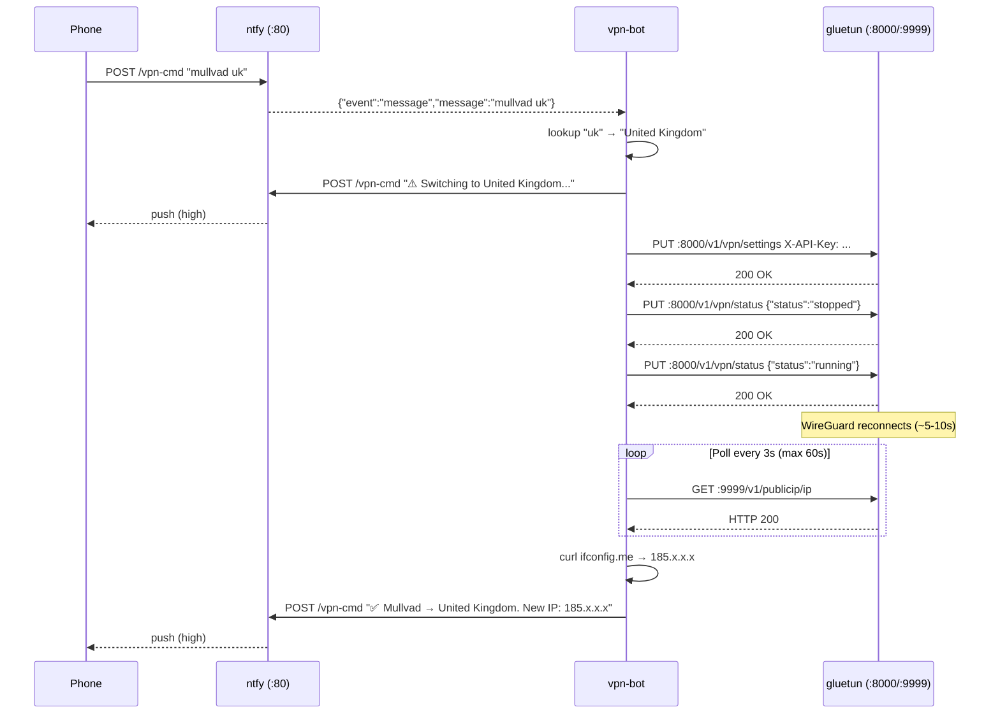

# 002-MULLVAD-COUNTRY-SWITCH: Mullvad Country Switcher — Technical Design

**Status**: Complete
**PRD**: [2026-03-20-002-MULLVAD-COUNTRY-SWITCH-prd.md](2026-03-20-002-MULLVAD-COUNTRY-SWITCH-prd.md)
**Created**: 2026-03-20
**Revised**: 2026-03-22 — replaced HTTP API approach with sidecar + compose recreate

---

## Overview

Extend the VPN stack with a `mullvad <country>` command family. The bot
validates keywords and dispatches switch requests via file-based IPC to a
dedicated `mullvad-switcher` sidecar container. The switcher performs a
full `docker compose up --force-recreate gluetun` with the new country,
waits for health, recreates all namespace-dependent containers, verifies
the IP changed, and reports back via ntfy.

**Why a sidecar?** The bot runs in `network_mode: service:gluetun` and
dies when gluetun restarts. The sidecar runs on `bridge_vpn` with its
own network stack, surviving gluetun restarts. See
`docs/gluetun-vpn-status-api-bug.md` for why the HTTP API approach failed.

---

## Current Architecture

**Verified against live container:**

- **Port 9999** (`127.0.0.1` only): minimal healthcheck endpoint. GET returns
  HTTP 200 with empty body when tunnel is up. Does not accept writes. Used only
  as a liveness probe.
- **Port 8000** (all interfaces): full HTTP control server. Currently returns
  401 — no auth config file exists yet. Supports `PUT /v1/vpn/settings` and
  `PUT /v1/vpn/status` for runtime reconfiguration.
- `HTTP_CONTROL_SERVER_AUTH_CONFIG_FILEPATH=/gluetun/auth/config.toml` — already
  set in gluetun's env. The file just doesn't exist yet.
- `HTTP_CONTROL_SERVER_AUTH_DEFAULT_ROLE={}` — empty object means no default
  role is granted; all routes require explicit auth.

**Why the original `docker update --env` approach failed:**

`docker update --env` does override the env var in Docker's container metadata,
but `docker compose up` re-injects the compose `environment:` block on every
container start, overwriting the update. The change only persists until the next
compose-driven restart — which happens on every deploy. Additionally, vpn-bot
shares gluetun's network namespace, so `docker restart gluetun` kills the bot
mid-execution before it can poll for recovery.

**Relevant bot patterns (from 001-NTFY-CONTROL):**

- `bot/bot.sh` — single-file command dispatcher. All new logic lives here.
- `reply()` — POST to ntfy with Title + Priority headers.
- `check_rate_limit()` — 60s per-command cooldown.
- Docker socket mounted at `/var/run/docker.sock` (still used for other cmds).

---

## Proposed Design

### Auth Config: gluetun/auth/config.toml

A new file mounted into the gluetun container granting the bot an API key
with access to the settings and status endpoints only:

```toml
[[roles]]
name = "vpn-bot"
routes = [
  "GET /v1/vpn/status",
  "PUT /v1/vpn/status",
  "GET /v1/vpn/settings",
  "PUT /v1/vpn/settings",
]
auth = "apikey"
apikey = "{{ GLUETUN_API_KEY }}"
```

The actual key value comes from `.env` / `GLUETUN_API_KEY`. The file is
generated or templated at deploy time (see Files to Create).

Since this file contains a secret, it must not be committed. It is generated
on the VPS from the env var by a deploy-time step.

### docker-compose.yml Changes

Two additions:

1. Mount `gluetun/auth/` into gluetun:
   ```yaml
   gluetun:
     volumes:
       - ./gluetun/post-rules.txt:/iptables/post-rules.txt
       - ./gluetun/auth:/gluetun/auth:ro
   ```

2. Pass `GLUETUN_API_KEY` to vpn-bot:
   ```yaml
   vpn-bot:
     environment:
       - GLUETUN_API_KEY=${GLUETUN_API_KEY}
   ```

### .env.example

Add: `GLUETUN_API_KEY=change-me`

### Country Lookup Table (unchanged from original design)

```sh
mullvad_country_name() {
    case "$1" in
        us) echo "United States" ;;  uk) echo "United Kingdom" ;;
        nl) echo "Netherlands" ;;    de) echo "Germany" ;;
        fr) echo "France" ;;         ch) echo "Switzerland" ;;
        se) echo "Sweden" ;;         fi) echo "Finland" ;;
        be) echo "Belgium" ;;        cy) echo "Cyprus" ;;
        ca) echo "Canada" ;;         jp) echo "Japan" ;;
        sg) echo "Singapore" ;;      th) echo "Thailand" ;;
        id) echo "Indonesia" ;;      il) echo "Israel" ;;
        tr) echo "Turkey" ;;         al) echo "Albania" ;;
        ua) echo "Ukraine" ;;        za) echo "South Africa" ;;
        ng) echo "Nigeria" ;;        *)  echo "" ;;
    esac
}
```

### `cmd_mullvad_switch` — Hot-Switch Flow

```
1. Lookup country name; if empty → error reply, return
2. reply "⚠️ Switching to {Country}..." (priority: high)
3. PUT :8000/v1/vpn/settings
      -H "X-API-Key: ${GLUETUN_API_KEY}"
      {"provider":{"server_selection":{"countries":["{Country}"]}}}
   If non-200 → error reply, return (tunnel untouched)
4. PUT :8000/v1/vpn/status  {"status":"stopped"}
5. PUT :8000/v1/vpn/status  {"status":"running"}
6. Poll :9999/v1/publicip/ip every 3s, up to 20× (60s)
   HTTP 200 = tunnel up
7. On success: fetch ifconfig.me → reply "✅ Mullvad → {Country}. New IP: {ip}"
8. On timeout: reply "⚠️ Gluetun did not recover in 60s." (priority: urgent)
```

**Key difference from original**: bot stays alive throughout — gluetun container
never restarts. Only the WireGuard tunnel inside gluetun cycles (~5–10s).
ntfy connection (port 80 via gluetun's network) may drop briefly during the
tunnel cycle but the bot's outer reconnect loop recovers it within 5s.

**API call detail:**
```sh
curl -sf -X PUT "http://127.0.0.1:8000/v1/vpn/settings" \
    -H "X-API-Key: ${GLUETUN_API_KEY}" \
    -H "Content-Type: application/json" \
    -d "{\"provider\":{\"server_selection\":{\"countries\":[\"${country}\"]}}}"
```
`${country}` is always a hardcoded string from `mullvad_country_name()`.

### Sequence Diagram



---

## Security Model

**Auth:** API key via `X-API-Key` header. The key never appears in logs (not
echoed by the bot). `GLUETUN_API_KEY` is injected as an env var, consistent
with all other secrets in this project.

**Injection:** `${country}` in the JSON body is always a hardcoded string from
the lookup table — never derived from user input. JSON metacharacters are
impossible since country names only contain letters and spaces.

**Scope:** The auth config grants the bot only the 4 settings/status endpoints.
Other control server routes (port forwarding, updater, DNS) are not accessible
with this key.

---

## Failure Modes

| Failure | Behaviour |
|---------|-----------|
| Unknown keyword | Error reply, nothing touched |
| `PUT /v1/vpn/settings` fails (non-200) | Error reply, tunnel untouched |
| `PUT /v1/vpn/status stopped` fails | Error reply; settings were updated but tunnel still running |
| `PUT /v1/vpn/status running` fails | Error reply; bot reports failure |
| Tunnel doesn't recover in 60s | Urgent reply; gluetun may self-recover |
| ntfy drops briefly during tunnel cycle | Bot reconnects via outer retry loop (5s) |
| ifconfig.me unavailable after tunnel up | Report "IP unavailable", still confirm switch |

---

## Files to Create

- **`gluetun/auth/config.toml`** — API key auth config for gluetun. Contains
  `GLUETUN_API_KEY` value. Generated on VPS from `.env`, not committed.

## Files to Modify

- **`bot/bot.sh`** — add lookup function, `cmd_mullvad_switch()`,
  `cmd_mullvad_list()`, dispatcher entries, help text update.
  `GLUETUN_API_KEY` read from env var (already available via compose).
- **`docker-compose.yml`** — mount `./gluetun/auth:/gluetun/auth:ro` into
  gluetun; add `GLUETUN_API_KEY` env var to vpn-bot.
- **`.env.example`** — add `GLUETUN_API_KEY=change-me`.

---

## Rejected Alternatives

### 1. `docker update --env` + `docker restart gluetun`

Attempted in production. Two fatal flaws: (a) compose overwrites docker-update
env overrides on next deploy, so country reverts; (b) vpn-bot shares gluetun's
network namespace — `docker restart gluetun` kills the bot mid-execution,
meaning no polling or success notification is ever sent.

### 2. Mount a `country.env` file, trigger `docker compose up --force-recreate`

Compose binary not present in bot container; requires full container restart
with the same namespace-death problem. Replaced by the hot-switch API approach.

### 3. Custom gluetun Docker image

Not needed — the upstream image already supports `PUT /v1/vpn/settings`.
The only missing piece was auth config, which is a mount, not a custom image.

### 4. Confirm flow before switch

Country switching is fully recoverable. Reserved for destructive operations.

---

## Implemented Architecture (Sidecar Approach)

The HTTP API approach documented above was attempted and failed. The actual
implementation uses a sidecar container:

### Components

1. **vpn-bot** (`bot/bot.sh`) — receives `mullvad <cc>` command, validates
   keyword via `mullvad_country_name()`, writes country name to
   `/data/switch-request` (shared volume).

2. **mullvad-switcher** (`switcher/switcher.sh`) — polls `/data/switch-request`
   every 2s. On trigger:
   - Captures pre-switch IP via `docker exec gluetun wget ifconfig.me/ip`
   - Runs `MULLVAD_COUNTRY=<country> docker compose up -d --force-recreate gluetun`
   - Polls `docker inspect --format='{{.State.Health.Status}}' gluetun` (30×3s = 90s)
   - Recreates namespace-dependent containers (ntfy, healthcheck, route-init,
     tailscale, vpn-bot)
   - Captures post-switch IP and compares with pre-switch
   - Reports success (IP changed) or failure (IP unchanged) via ntfy
   - Writes `ok <ip>` or `err <reason>` to `/data/switch-result`

3. **switcher-data volume** — shared between vpn-bot and mullvad-switcher for
   IPC files (`switch-request`, `switch-result`).

### Compose Path Resolution

The switcher container mounts the host project directory at `/project/` (read-only).
The compose command uses three flags to bridge the container/host namespace gap:

- `-f /project/docker-compose.yml` — compose file location (inside container)
- `--env-file /project/.env` — secrets (inside container, from bind mount)
- `--project-directory /home/povesma/vpn` — host path for the Docker daemon to
  resolve relative volume mounts like `./gluetun/post-rules.txt`

### Sequence Diagram

```
Phone → ntfy → vpn-bot: "mullvad uk"
vpn-bot: lookup "uk" → "United Kingdom"
vpn-bot: write "United Kingdom" → /data/switch-request
vpn-bot → ntfy → Phone: "🕐 Switching to United Kingdom..."

mullvad-switcher: detect /data/switch-request
mullvad-switcher: capture old IP (149.x.x.x)
mullvad-switcher: MULLVAD_COUNTRY="United Kingdom" compose up -d --force-recreate gluetun
mullvad-switcher: poll docker inspect gluetun health (up to 90s)
mullvad-switcher: compose up -d --force-recreate ntfy healthcheck route-init tailscale vpn-bot
mullvad-switcher: capture new IP (185.x.x.x)
mullvad-switcher: compare old vs new → IP changed → success
mullvad-switcher → ntfy → Phone: "✅ Mullvad → United Kingdom. IP: 149.x.x.x → 185.x.x.x"
```

### Key Differences from HTTP API Approach

| Aspect | HTTP API (abandoned) | Sidecar (implemented) |
|--------|---------------------|----------------------|
| Bot survives switch | Yes (tunnel-only cycle) | No (recreated after gluetun) |
| Downtime | ~5-10s (tunnel cycle) | ~60-90s (full recreate + dependents) |
| Country persistence | No (API changes lost on restart) | Yes (compose env var) |
| Complexity | Low (curl calls) | Medium (sidecar + IPC + compose) |
| Reliability | Broken (gluetun bug) | Working |
