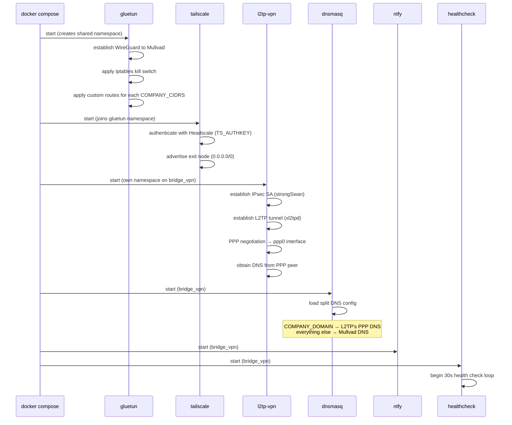
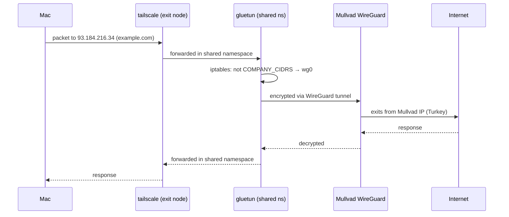
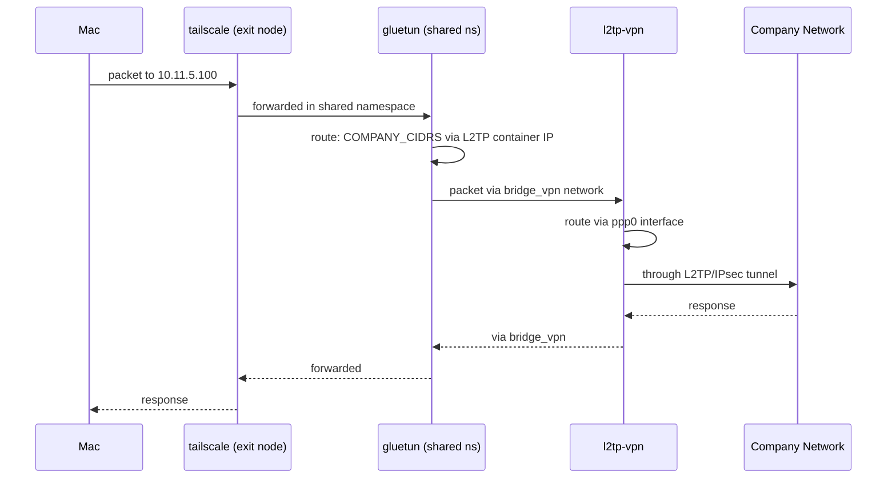
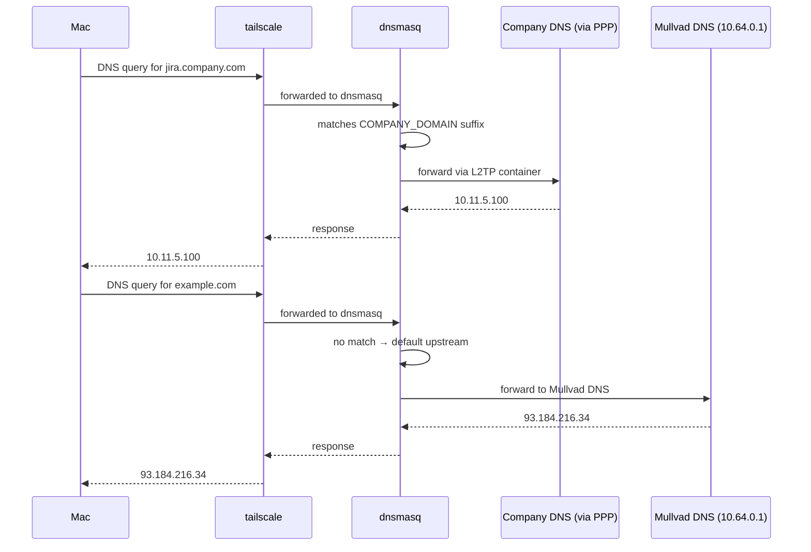
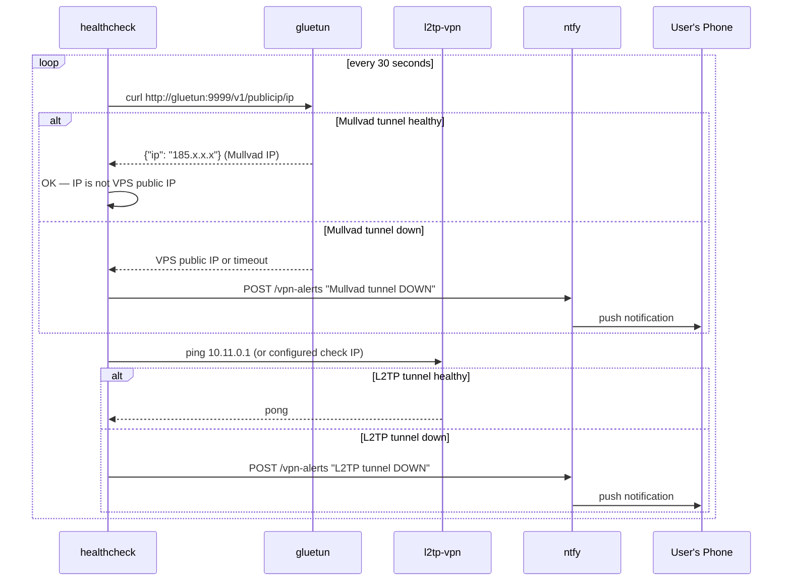

# Tailscale Exit Node VPN Router - Technical Design Document

## Reference Documents

- **PRD**: `2026-03-17-VPN-001-tailscale-exit-node-vpn-router-prd.md`
- **Prior art**: [alexmaisa/tailscale-vpn-exitnode](
  https://github.com/alexmaisa/tailscale-vpn-exitnode) —
  Tailscale + gluetun exit node pattern (single VPN only)

## High-Level Architecture

### System Overview

The stack uses Docker Compose with shared network namespaces
to chain Tailscale through Mullvad VPN, with a policy-routing
carve-out for company traffic via L2TP/IPsec. All routing
happens inside container network namespaces — the host VPS
routing table is never modified.

The core insight: gluetun owns the primary network namespace.
Tailscale joins it via `network_mode: service:gluetun`. This
means all Tailscale exit-node traffic naturally flows through
the Mullvad WireGuard tunnel. Company traffic (CIDRs from
`COMPANY_CIDRS` env var) is carved out via gluetun's custom
routing rules and sent to
the L2TP container over a shared Docker bridge network.

### Architecture Diagram

```
┌─────────────────────────────────────────────────────┐
│                    VPS (host)                        │
│  (only requirement: docker, ip_forward=1)           │
│                                                     │
│  ┌───────────────────────────────────────────────┐  │
│  │         Shared Network Namespace              │  │
│  │         (owned by gluetun)                    │  │
│  │                                               │  │
│  │  ┌─────────────┐    ┌──────────────────────┐  │  │
│  │  │  tailscale  │    │       gluetun        │  │  │
│  │  │             │    │                      │  │  │
│  │  │ exit node   │    │ wg0 ──► Mullvad     │  │  │
│  │  │ ts0 iface   │    │ eth0 ──► bridge_vpn │  │  │
│  │  │             │    │                      │  │  │
│  │  └─────────────┘    │ routing rules:       │  │  │
│  │                     │ COMPANY_CIDRS → L2TP │  │  │
│  │                     │ 0.0.0.0/0    → wg0   │  │  │
│  │                     └──────────────────────┘  │  │
│  └──────────────────────────┬────────────────────┘  │
│                             │ eth0 (bridge_vpn)     │
│                             │                       │
│  ┌──────────────────────────┼────────────────────┐  │
│  │            Docker network: bridge_vpn         │  │
│  │                          │                    │  │
│  │  ┌──────────────┐  ┌────┴─────┐  ┌────────┐  │  │
│  │  │   l2tp-vpn   │  │  dnsmasq │  │  ntfy  │  │  │
│  │  │              │  │          │  │        │  │  │
│  │  │ ppp0 ──►     │  │ :53 DNS  │  │ :2586  │  │  │
│  │  │  company VPN │  │ split    │  │ push   │  │  │
│  │  │ eth0 ──►     │  │ routing  │  │ notif  │  │  │
│  │  │  bridge_vpn  │  │          │  │        │  │  │
│  │  └──────────────┘  └──────────┘  └────────┘  │  │
│  └───────────────────────────────────────────────┘  │
│                                                     │
│  ┌───────────────────────────────────────────────┐  │
│  │              healthcheck (cron)               │  │
│  │  checks tunnel status → POST to ntfy         │  │
│  └───────────────────────────────────────────────┘  │
└─────────────────────────────────────────────────────┘
```

### Container Roles

| Container     | Image                          | Network                | Role                              |
|---------------|--------------------------------|------------------------|-----------------------------------|
| `gluetun`     | `qmcgaw/gluetun`              | `bridge_vpn` (primary) | Mullvad WireGuard, routing owner  |
| `tailscale`   | `tailscale/tailscale`          | `service:gluetun`      | Exit node on Headscale            |
| `l2tp-vpn`    | custom Alpine + strongSwan     | `bridge_vpn`           | L2TP/IPsec to company VPN         |
| `dnsmasq`     | custom Alpine + dnsmasq        | `bridge_vpn`           | Split DNS resolver                |
| `ntfy`        | `binwiederhier/ntfy`           | `bridge_vpn`           | Push notification server          |
| `healthcheck` | custom Alpine + curl + script  | `bridge_vpn`           | Tunnel health monitoring          |

### Integration Points

- **Headscale**: Tailscale container authenticates via
  `TS_AUTHKEY` and registers as exit node. Headscale must
  approve the `0.0.0.0/0` route (via autoApprovers or CLI).
- **Mullvad**: Gluetun connects using WireGuard with account
  credentials. Server selection via `MULLVAD_COUNTRY` env var.
- **Company VPN**: L2TP container connects using strongSwan
  (IPsec) + xl2tpd (L2TP) with PSK + username/password from
  `.env`.
- **ntfy**: Health checker POSTs to ntfy over the Docker
  bridge network. User subscribes from phone/desktop via
  Tailscale IP or ntfy port exposed on the Tailscale
  interface.

## Detailed Design

### Network Namespace Strategy

**Why gluetun owns the namespace:**
Gluetun is purpose-built to manage a VPN network namespace
with kill-switch iptables rules. By making it the namespace
owner and having Tailscale join via `network_mode: service:
gluetun`, we get:
- Mullvad kill switch for free (gluetun's iptables)
- Tailscale exit-node traffic automatically routed through
  Mullvad
- No custom iptables management for the default route

**Why L2TP is separate:**
L2TP needs its own network namespace because:
- It runs strongSwan + xl2tpd which need their own ppp0
  interface
- Gluetun's kill switch would block L2TP tunnel establishment
  (company VPN server IP is not on the Mullvad tunnel)
- Isolation: if company VPN crashes, it doesn't affect Mullvad

**Communication between namespaces:**
The `bridge_vpn` Docker network connects gluetun (and thus
tailscale) to l2tp-vpn. Gluetun uses a custom route
(`/iptables/post-rules.txt` and `ip route`) to send
`COMPANY_CIDRS` traffic to the L2TP container's IP on the
bridge network instead of through the WireGuard tunnel.

### Sequence Diagrams

#### Startup Sequence



#### Traffic Flow — Internet Request (via Mullvad)



#### Traffic Flow — Company Request (via L2TP)



#### Traffic Flow — DNS Query



#### Health Check & Notification Flow



### System Components

#### gluetun (Network Namespace Owner)

**Responsibilities:**
- Establish and maintain WireGuard tunnel to Mullvad
- Own the shared network namespace (tailscale joins it)
- Enforce VPN kill switch via iptables
- Route `COMPANY_CIDRS` to L2TP container via bridge network
- Provide `FIREWALL_OUTBOUND_SUBNETS` for bridge access

**Key configuration:**
- `VPN_SERVICE_PROVIDER=mullvad`
- `VPN_TYPE=wireguard`
- `WIREGUARD_PRIVATE_KEY` and `WIREGUARD_ADDRESSES` from
  `.env`
- `SERVER_COUNTRIES` from `MULLVAD_COUNTRY` env var
- `FIREWALL_OUTBOUND_SUBNETS=172.20.0.0/16` (bridge_vpn
  subnet, for L2TP and dnsmasq access)
- Custom routing: a startup script iterates over
  `COMPANY_CIDRS` and for each CIDR adds iptables rules
  (via `/iptables/post-rules.txt`) and ip routes to send
  traffic to the L2TP container's bridge IP

**Failover behavior:**
Gluetun's built-in kill switch blocks all traffic if the
WireGuard tunnel drops. To achieve fail-open (REQ-06), we
must configure `FIREWALL_VPN_INPUT_PORTS` and
`FIREWALL=off` is NOT an option. Instead, the healthcheck
detects the failure and the user decides. The kill switch
actually provides stronger security than fail-open — we
should reconsider REQ-06.

> **Design decision: Kill switch (fail-closed) — DECIDED**
>
> Gluetun's built-in kill switch blocks all traffic when the
> WireGuard tunnel drops. This is the v1 behavior. The
> healthcheck + ntfy alerts the user, who can then disconnect
> the exit node from their Mac if they need internet.
> Fail-open mode is a future consideration.

#### tailscale (Exit Node)

**Responsibilities:**
- Authenticate with Headscale server
- Advertise as exit node (`--advertise-exit-node`)
- Forward all received exit-node traffic into the shared
  namespace (gluetun handles routing from there)
- Use dnsmasq as DNS resolver

**Key configuration:**
- `TS_AUTHKEY` from `.env`
- `TS_EXTRA_ARGS=--advertise-exit-node`
- `TS_USERSPACE=false` (required for exit node functionality)
- `TS_STATE_DIR=/var/lib/tailscale` (persisted volume)
- `TS_ACCEPT_DNS=false` (we manage DNS ourselves)
- `network_mode: service:gluetun`

**Headscale requirements:**
The Headscale ACL policy must include:

```json
{
  "autoApprovers": {
    "exitNode": ["tag:vpn-router"]
  }
}
```

Or manually approve via: `headscale routes enable -r <id>`

#### l2tp-vpn (Company VPN)

**Responsibilities:**
- Establish IPsec SA using strongSwan
- Establish L2TP tunnel using xl2tpd
- Negotiate PPP session → creates ppp0 interface
- Extract DNS server from PPP negotiation (`usepeerdns`)
- Route company traffic (`COMPANY_CIDRS`) via ppp0
- Enable IP forwarding so gluetun can route through it

**Custom image (Alpine-based):**
This will be a custom Dockerfile because existing L2TP
client Docker images are mostly unmaintained. Alpine +
strongSwan + xl2tpd is small (~30MB) and reliable.

**Key files in the image:**
- `/etc/ipsec.conf` — IPsec connection config (templated
  from env vars at startup)
- `/etc/ipsec.secrets` — PSK (generated from env vars)
- `/etc/xl2tpd/xl2tpd.conf` — L2TP connection config
- `/etc/ppp/options.l2tpd.client` — PPP options including
  `usepeerdns`
- `/entrypoint.sh` — generates configs from env vars,
  starts strongSwan, starts xl2tpd, connects

**Environment variables consumed from `.env`:**
- `L2TP_SERVER` — company VPN server address
- `L2TP_USERNAME` — VPN username
- `L2TP_PASSWORD` — VPN password
- `L2TP_PSK` — shared secret (pre-shared key)
- `COMPANY_CIDRS` — comma-separated CIDRs
  (e.g. `10.11.0.0/16,10.12.0.0/16`)

**PPP DNS extraction:**
When `usepeerdns` is set, PPP writes the peer's DNS
servers to `/etc/ppp/resolv.conf`. The entrypoint script
watches for this file and writes the DNS IP to a shared
volume that dnsmasq reads.

#### dnsmasq (Split DNS)

**Responsibilities:**
- Resolve company domains via company DNS (from PPP)
- Resolve everything else via Mullvad DNS (10.64.0.1)
- Lightweight, no caching complexity needed for v1

**Configuration approach:**
A small startup script generates `dnsmasq.conf` from:
- `COMPANY_DOMAIN` env var (e.g., `company.com`)
- Company DNS IP from shared volume (written by L2TP
  container)
- Mullvad DNS as default upstream (`server=10.64.0.1`)

**dnsmasq.conf (generated at startup):**
```
# Forward company domains to company DNS
server=/company.com/<COMPANY_DNS_IP>

# Default: Mullvad DNS
server=10.64.0.1

# Don't use host's resolv.conf
no-resolv

# Listen on all interfaces in container
listen-address=0.0.0.0

# Small cache is fine
cache-size=150
```

**Startup dependency:**
dnsmasq must wait for the L2TP container to write the
company DNS IP. A simple retry loop with sleep handles
this (max 60s, then start with Mullvad-only DNS and
alert via ntfy).

#### ntfy (Notifications)

**Responsibilities:**
- Receive HTTP POST alerts from healthcheck
- Serve push notifications to subscribed clients

**Configuration:** Minimal. Default ntfy config is
sufficient. The topic name is hardcoded to `vpn-alerts`.

**Access from Mac:** ntfy is accessible via the Tailscale
network at `http://<exit-node-tailscale-ip>:2586`. The
user subscribes to the `vpn-alerts` topic using the ntfy
app or web UI.

**Port exposure:** ntfy's port 2586 is published on the
gluetun container (since tailscale shares its namespace),
making it accessible via the Tailscale IP. Alternatively,
ntfy connects to the bridge_vpn network and the
healthcheck reaches it there.

#### healthcheck (Monitoring)

**Responsibilities:**
- Check Mullvad tunnel status every 30 seconds
- Check L2TP tunnel status every 30 seconds
- Send ntfy notification on state change (not every check)
- Track state to avoid notification spam

**Implementation:** A simple shell script in an Alpine
container with curl and ping.

**Health check logic:**

```
# Mullvad check: use gluetun's built-in API
response = curl gluetun:9999/v1/publicip/ip
if response.ip == VPS_PUBLIC_IP or timeout:
    mullvad_down = true

# L2TP check: ping a known company IP
ping -c1 -W5 $L2TP_CHECK_IP via l2tp-vpn container
if timeout:
    l2tp_down = true

# Notify only on state change
if state_changed:
    curl -d "Tunnel X is DOWN/UP" ntfy:2586/vpn-alerts
```

**Environment variables:**
- `VPS_PUBLIC_IP` — to detect Mullvad failure
- `L2TP_CHECK_IP` — company IP to ping (e.g., `10.11.0.1`)
- `NTFY_URL` — ntfy endpoint (default: `http://ntfy:2586`)
- `CHECK_INTERVAL` — seconds between checks (default: 30)

### State Management

**Persistent state (Docker volumes):**
- `ts-state:/var/lib/tailscale` — Tailscale node identity
  and keys. Without this, a new node registers on every
  restart.
- `ntfy-cache:/var/cache/ntfy` — notification queue
  (optional, prevents lost notifications during restart)

**Ephemeral state:**
- Gluetun WireGuard session — re-established on restart
- L2TP/IPsec tunnel — re-established on restart
- PPP DNS IP — re-extracted on each L2TP connection
- Health check state — resets on restart (first check
  establishes baseline)

**Shared state between containers:**
- Company DNS IP: L2TP writes to a shared volume, dnsmasq
  reads it. Simple file-based IPC.
  Volume: `shared-config:/shared`
  File: `/shared/company-dns-ip`

### Routing Rules Detail

**Inside gluetun's namespace (where tailscale also lives):**

Gluetun automatically creates:
```
# Default route through WireGuard
default via <wg_gateway> dev wg0

# Kill switch iptables (simplified)
iptables -P OUTPUT DROP
iptables -A OUTPUT -o wg0 -j ACCEPT
iptables -A OUTPUT -o lo -j ACCEPT
iptables -A OUTPUT -d <bridge_vpn_subnet> -o eth0 -j ACCEPT
```

Custom additions (generated from `COMPANY_CIDRS` at startup,
written to `/iptables/post-rules.txt`):
```
# For each CIDR in COMPANY_CIDRS:
iptables -A OUTPUT -d <cidr> -o eth0 -j ACCEPT
iptables -t nat -A POSTROUTING -d <cidr> -j MASQUERADE
```

Custom routes (generated from `COMPANY_CIDRS` at startup):
```
# For each CIDR in COMPANY_CIDRS:
ip route add <cidr> via <l2tp_bridge_ip> dev eth0
```

**Inside l2tp-vpn's namespace:**
```
# For each CIDR in COMPANY_CIDRS:
ip route add <cidr> dev ppp0

# Enable forwarding so gluetun can route through us
sysctl net.ipv4.ip_forward=1
```

## API Design

No REST APIs are built for v1. Interfaces between
components use:

- **gluetun API** (built-in): `GET :9999/v1/publicip/ip`
  for health checks
- **ntfy API** (built-in): `POST :2586/<topic>` with
  plaintext body for notifications
- **File-based IPC**: `/shared/company-dns-ip` for DNS
  server discovery between L2TP and dnsmasq containers

## Data Considerations

No databases. All configuration is in environment variables
(`.env`) and generated config files. Persistent state is
limited to Tailscale identity (volume) and ntfy cache
(volume).

### `.env.example` Variables

```bash
# --- Tailscale / Headscale ---
TS_AUTHKEY=tskey-auth-xxxxx
TS_HOSTNAME=vpn-router
HEADSCALE_URL=https://headscale.example.com

# --- Mullvad ---
WIREGUARD_PRIVATE_KEY=xxxxx
WIREGUARD_ADDRESSES=10.66.x.x/32
MULLVAD_COUNTRY=Turkey

# --- Company VPN (L2TP/IPsec) ---
L2TP_SERVER=vpn.company.com
L2TP_USERNAME=user
L2TP_PASSWORD=pass
L2TP_PSK=shared-secret
COMPANY_CIDRS=10.11.0.0/16,10.12.0.0/16
COMPANY_DOMAIN=company.com

# --- Health Check ---
VPS_PUBLIC_IP=203.0.113.1
L2TP_CHECK_IP=10.11.0.1
CHECK_INTERVAL=30

# --- ntfy ---
NTFY_TOPIC=vpn-alerts
```

## Performance, Scalability, and Reliability

### Performance

- **WireGuard overhead**: ~5% throughput reduction vs raw,
  negligible latency. Gluetun adds no measurable overhead
  beyond WireGuard itself.
- **L2TP/IPsec overhead**: Higher than WireGuard (~10-15%),
  but only used for company traffic which is low volume.
- **Extra hop**: All traffic goes Mac → VPS → VPN → Internet.
  Latency depends on VPS location. This is inherent to the
  architecture and cannot be optimized away.

### Reliability Patterns

- **Container restarts**: All containers use
  `restart: unless-stopped`. Docker Compose handles
  dependency ordering via `depends_on`.
- **Tunnel reconnection**: Both gluetun and strongSwan
  auto-reconnect on transient failures.
- **DNS fallback**: If company DNS is unavailable, dnsmasq
  returns NXDOMAIN for company domains (correct behavior —
  company resources are unreachable anyway).
- **Health check debounce**: Notify only on state *change*,
  not on every failed check. Prevents notification storms
  during flapping.

### Monitoring

- **Health check container**: Checks every 30s, alerts via
  ntfy on state change.
- **Docker health checks**: Each container declares a
  `healthcheck` in docker-compose for `docker ps` visibility.
- **Container logs**: `docker compose logs -f` for debugging.
  No centralized logging for v1.

## Open-Source Readiness

To support future open-source publication without slowing
down development:

- **`.env.example`** committed to git with placeholder values
  and comments. `.env` in `.gitignore`.
- **`README.md`**: Written as part of implementation. Covers
  prerequisites, setup, usage, and architecture diagram.
- **`LICENSE`**: Add at publish time (recommend MIT or
  Apache-2.0).
- **No secrets in code**: All secrets in `.env`, all config
  templates use env var substitution.
- **Custom images use Dockerfiles**: No pre-built private
  images. Everything builds from source via `docker compose
  build`.

## Rejected Alternatives

### 1. Tailscale as namespace owner (instead of gluetun)

**Why rejected:** Tailscale's Docker image doesn't have
built-in kill switch or VPN routing. We'd need to manually
manage iptables for the Mullvad WireGuard tunnel, which is
exactly what gluetun already does well.

### 2. Single container with all VPNs

**Why rejected:** Combining Tailscale + WireGuard + L2TP in
one container creates a fragile monolith. If L2TP crashes,
it could take down Mullvad. Separate containers provide
fault isolation.

### 3. Host-level routing instead of container routing

**Why rejected:** PRD requirement (REQ-12). Also makes the
setup non-portable and harder to reason about.

### 4. Mullvad app instead of gluetun

**Why rejected:** Mullvad's app doesn't run headless in
Docker well. Gluetun is purpose-built for this use case,
supports Mullvad WireGuard, and has a large community.

### 5. Fail-open by default

**Why rejected:** Gluetun's kill switch provides fail-closed
behavior which is more appropriate for a privacy tool. If
Mullvad drops and traffic goes through the VPS's raw IP,
the user's real browsing activity is exposed from the VPS
IP — which may be worse than no internet. The healthcheck +
ntfy alerts the user to take action. This can be
reconsidered in v2 with a `FAILOVER_MODE` option.

### 6. CoreDNS instead of dnsmasq

**Why rejected:** CoreDNS is more powerful but heavier
(~45MB vs ~1MB) and more complex to configure. dnsmasq's
`server=/domain/ip` syntax is perfectly suited for our
split DNS need with zero overhead.

## Open Questions

1. **Gluetun custom routing persistence**: Gluetun's
   `/iptables/post-rules.txt` runs on container start, but
   `ip route add` commands need a different mechanism (custom
   entrypoint wrapper or gluetun's up script). Need to verify
   the exact hook during implementation.

2. **L2TP container DNS extraction timing**: The PPP DNS
   file is written asynchronously after tunnel establishment.
   Need to verify the timing and implement a robust wait
   mechanism for dnsmasq.

3. **ntfy access via Tailscale**: Since ntfy runs on the
   bridge network (not in gluetun's namespace), we need to
   verify that it's reachable from the Mac via the Tailscale
   exit node. May need to expose ntfy's port on gluetun's
   namespace or use Tailscale's `--advertise-routes`.

4. ~~**Kill switch vs fail-open**~~: **RESOLVED** — fail-closed
   (gluetun kill switch) for v1. Fail-open is a future
   consideration.
